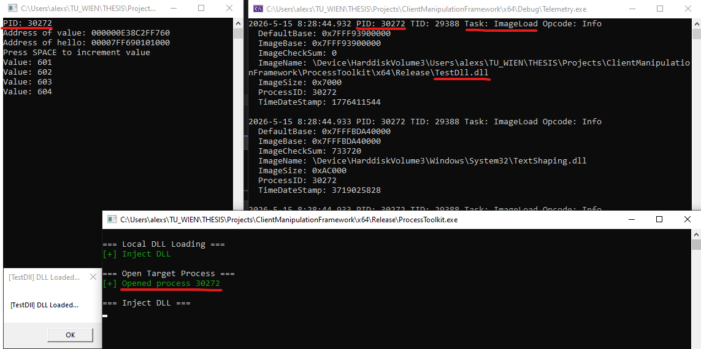

# ClientManipulationFramework

Research-oriented framework for experimenting with and analyzing client-side manipulation techniques on Windows systems.

The project focuses on low-level process interaction, telemetry collection, runtime behavior analysis, and operating-system-level observability of manipulation techniques such as DLL injection and memory manipulation.

[Basic Injection Log](Telemetry/basic_injection_run.json)

## Features

- Process enumeration and interaction
- Remote memory allocation and writing
- DLL injection experimentation
- ETW-based telemetry collection
- Runtime event monitoring
- JSONL telemetry logging
- Modular low-level Windows tooling
- Behavioral analysis experimentation

## Repository Structure

| Project | Description |
|---|---|
| `ProcessToolkit` | Low-level Windows process interaction primitives |
| `Telemetry` | ETW-based telemetry collector and runtime monitoring |
| `TestDll` | Test DLL used for injection experiments |
| `TestTarget` | Target application used during controlled experiments |

## Research Context

This repository is part of an ongoing Master's thesis focused on analyzing operating-system-level behavioral patterns produced by client-side manipulation techniques on Windows systems.

The goal is to study how techniques such as memory manipulation, code injection, and execution control manifest during execution and which system-level effects remain observable across different implementations and evasion strategies.

## Technologies

- C++
- Win32 API
- ETW (Event Tracing for Windows)
- Windows Internals

## Build

Requirements:
- Visual Studio 2022
- Windows SDK
- CMake (optional)

Open the solution: **ClientManipulationFramework.sln**  
Build using: **x64 Release**

## Disclaimer

This project is intended for research and educational purposes only.